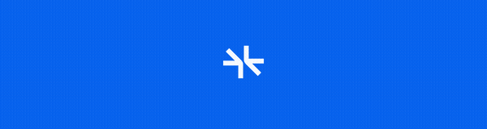
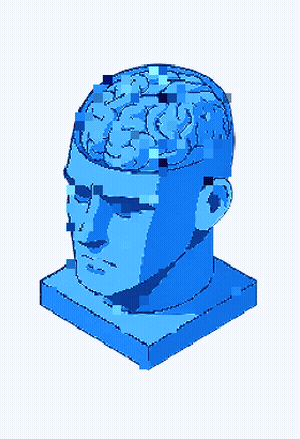

# landing-effects

Two configurable, zero-dependency canvas effects for landing pages. TypeScript, framework-agnostic.

## Effects

### ASCII Renderer

Converts any image into interactive ASCII art on a canvas — with mouse parallax, glitch bands, edge-inward reveal animation, and depth-based coloring.

<p align="center">
  
</p>

```ts
import { createAsciiRenderer } from 'landing-effects'

const cleanup = createAsciiRenderer({
  canvas: document.getElementById('my-canvas'),
  imageSrc: '/my-image.png',
})

// later: cleanup() to stop animation and remove listeners
```

**Options:**

| Option | Type | Default | Description |
|--------|------|---------|-------------|
| `canvas` | `HTMLCanvasElement` | required | Target canvas element |
| `imageSrc` | `string` | required | Source image URL |
| `chars` | `string` | `' 0123456789'` | Character set (dark → light) |
| `fontSize` | `number` | `9` | Font size in px |
| `fontFamily` | `string` | `'"DM Mono", monospace'` | Font family |
| `brightnessBoost` | `number` | `2.2` | Brightness multiplier |
| `posterize` | `number` | `32` | Posterization steps |
| `parallaxStrength` | `number` | `8` | Mouse parallax intensity |
| `scale` | `number` | `1.15` | Source image zoom |
| `colorFn` | `(luminance, distFromCenter) => string` | blue tint | Custom color function |

### Pixel Reveal

Randomized block-by-block image reveal → glitch refine → crisp final. Configurable glitch region so you can glitch just the top third, top half, or the entire image.

<p align="center">
  
</p>

```ts
import { createPixelReveal } from 'landing-effects'

const cleanup = createPixelReveal({
  canvas: document.getElementById('my-canvas'),
  imageSrc: '/my-image.png',
  glitchRegion: 1/3, // top third gets glitch treatment
})
```

**Options:**

| Option | Type | Default | Description |
|--------|------|---------|-------------|
| `canvas` | `HTMLCanvasElement` | required | Target canvas (set width/height attributes) |
| `imageSrc` | `string` | required | Source image URL |
| `blockSize` | `number` | `8` | Pixel block size |
| `pixelsPerFrame` | `number` | `120` | Blocks revealed per frame |
| `glitchRegion` | `number` | `0.36` | Fraction of height from top that gets glitch treatment (0-1) |
| `delay` | `number` | `200` | Delay before animation starts (ms) |
| `onComplete` | `() => void` | — | Called when reveal finishes |

## Install

```bash
npm install landing-effects
```

## Used by

- [supermemory.ai](https://supermemory.ai)

## License

MIT
